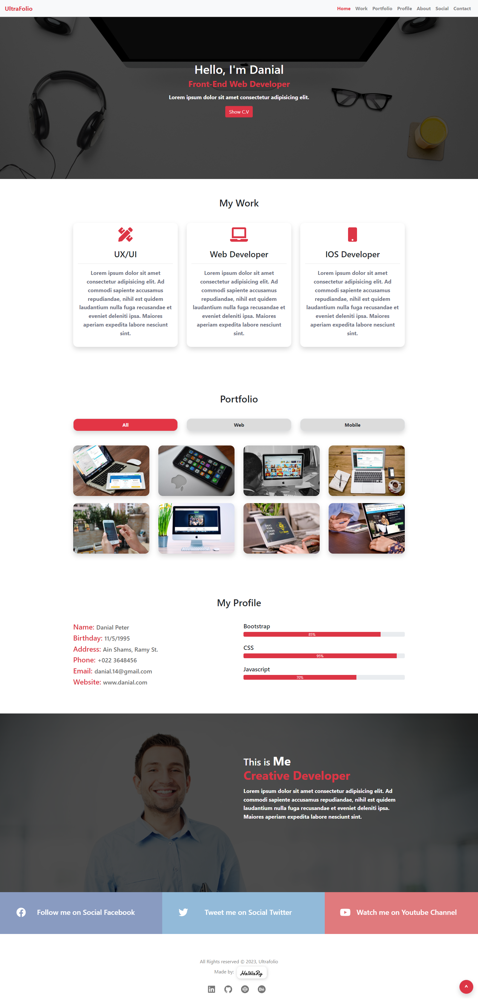

# Ultrafolio

[](https://app.netlify.com/sites/ultrafolio/deploys)

Ultrafolio is a website for a personal portfolio. It depends on JSON API to get the portfolio data.

You can view the website from [here](https://ultrafolio.netlify.app/)

 

## Demo

https://user-images.githubusercontent.com/69651552/218256329-98ca978e-e47b-4398-aa42-b3515b635e66.mp4

## Instructions, Building & Get Started 

    - 1- Fork, clone or download this repository to your local machine.
    - 2- Be sure that you install the Node.js environment in your machine.
    - 3- Open your terminal and be sure that you are inside the correct destination of the website, while you must be in the same path of the package.json file.
    - 4- Inside your terminal run these commands:-
    
        * to install dependencies.
        ```
        npm install
        ```
        * to start the server.
        ```
        npm start
        ```
    - 5- Once the website server is running, visit (localhost:3000) in the browser to view the website and now you can treat with it as shown above in the Demo.
    - 6- You can also see a live preview of the website from this link (https://ultrafolio.netlify.app/)

## Built With

* HTML
* CSS
* JS

## Libraries & Packages

* [React Router](https://www.npmjs.com/package/react-router)
* [React Router Dom](https://www.npmjs.com/package/react-router-dom)
* [Styled Components](https://styled-components.com/)
* [Axios](https://www.npmjs.com/package/axios)
* [Font Awesome](https://fontawesome.com/)
* [React Icons](https://react-icons.github.io/react-icons/)

## Frameworks 

* [React.js](https://reactjs.org/)  
* [React Bootstrap](https://react-bootstrap.github.io/)

## API  

* JSON 

## Author

* [Mohamed Elhawary](https://www.linkedin.com/in/mohamed-elhawary14/) 

## Contact me through my social accounts

* Email: mohamed.k.elhawary@gmail.com
* [LinkedIn](https://www.linkedin.com/in/mohamed-elhawary14/)
* [Github](https://github.com/Mohamed-Elhawary)  
* [Behance](https://www.behance.net/mohamed-elhawary14)
* [Codepen](https://codepen.io/Mohamed-ElHawary) 

## License

Licensed under the [MIT License](LICENSE)
